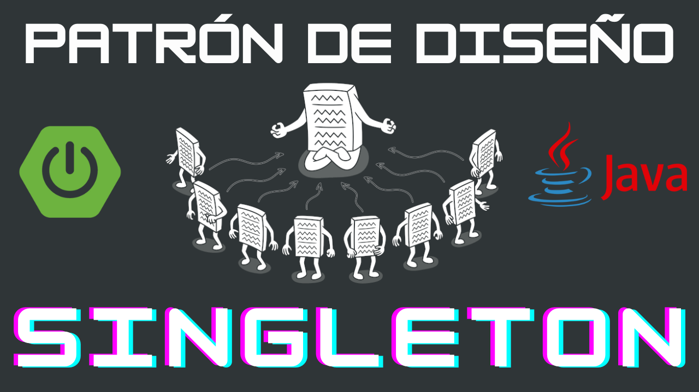
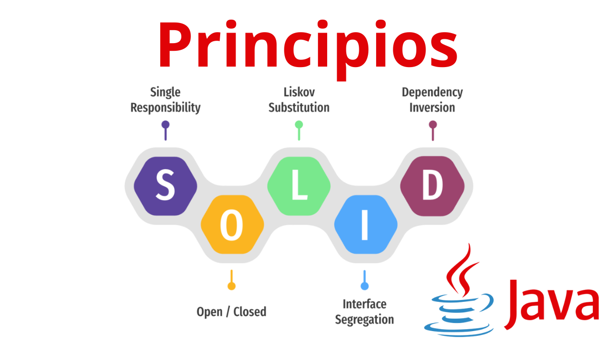
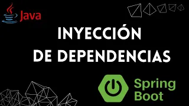

### Hola, Soy Jorge Meza 👋

##  Sobre mi

Soy desarrollador de software con mas de 9 años de experiencia en el mundo del desarrollo de software

- 📷 &nbsp; Tengo un canal de youtube en donde subo videos para ayudar a la comunidad
- 🤔 &nbsp; Me gusta explorar nuevas tecnologías
- 🏗️ &nbsp; Me gusta el diseño y arquitectura de software
- 🧑‍💼 &nbsp; Actualmente trabajo como Software Engineer Senior en una empresa con gran presencia en Latinoamérica

## Tecnologías:

<code></code>
<code></code>
<code></code>
<code></code>
<code></code>

<code></code>
<code></code>
<code></code>
<code></code>

<code></code>
<code></code>
<code></code>
<code></code>
<code></code>

<code></code>
<code></code>
<code></code>

<code></code>
<code></code>
<code></code>

## Últimos videos de mi [canal de Youtube](https://www.youtube.com/channel/UCKLYlrbPnf9DdfqxKkYbHOQ)

## Videos populares de mi [canal de Youtube](https://www.youtube.com/channel/UCKLYlrbPnf9DdfqxKkYbHOQ)

